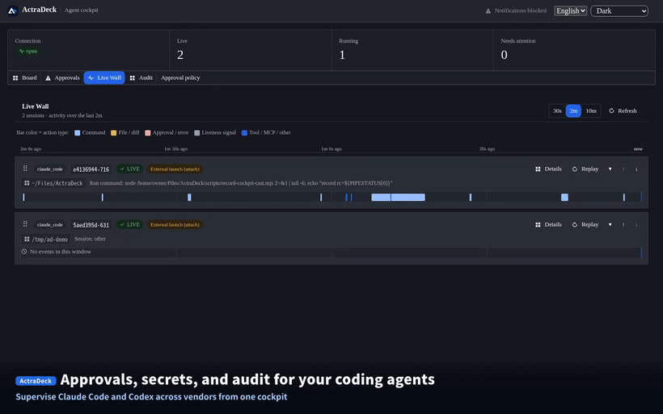
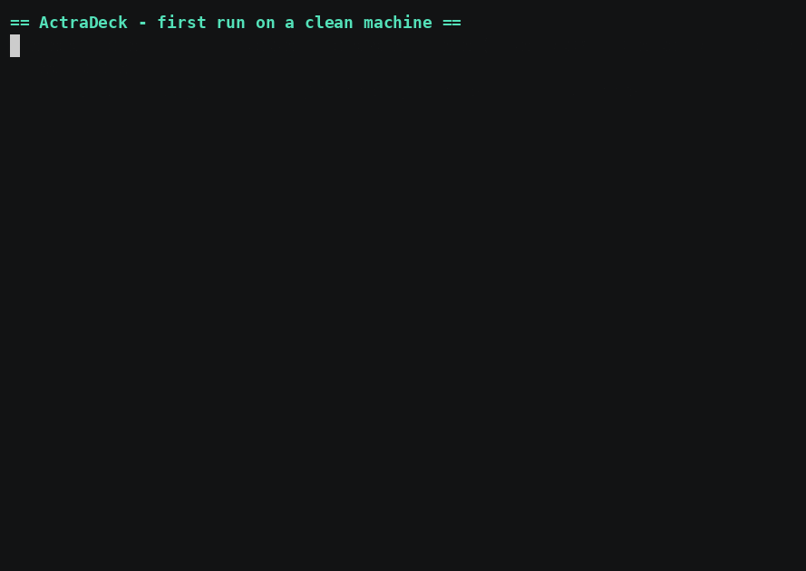

# ActraDeck

**The vendor-neutral control plane for coding agents — cross-vendor secret redaction and audit, with selective approval governance (Claude Code today, Codex in Managed Mode).**

ActraDeck sits beside your coding agents — Claude Code, Codex, and whatever comes
next — and gives you **one place to watch what they do, stop secrets before they
are stored, and keep an audit trail across vendors**. Approvals relay to the cockpit
for Claude Code out of the box, and for Codex in Managed Mode (see the
[support matrix](#vendor--mode-support)). It is local-first: a sidecar on your machine
collects structured events, redacts secrets _before_ anything is persisted, and serves
a web cockpit you control.

> Status: **early / active development (pre-1.0).** The pieces below work today; the
> declarative policy engine and team features are on the roadmap. Expect rough edges
> and breaking changes.

## See it in action

A walkthrough of the cockpit, recorded against a **live stack with real sessions**
(secrets are already masked at the sidecar before anything is shown):



▶ **Full walkthrough (~90s):** [`docs/media/usage.mp4`](./docs/media/usage.mp4) —
live wall, liveness-by-evidence, secret redaction with per-kind counts, cross-vendor
audit (Claude Code **and** Codex in one trail), the approval inbox, and session
replay. The 90-second product-story runbook is in
[`docs/demo-90s.md`](./docs/demo-90s.md); regenerate this recording from your own
stack with [`scripts/record-cockpit-cast.mjs`](./scripts/record-cockpit-cast.mjs).

## Why this exists

Vendors are already building great single-vendor dashboards (e.g. Claude Code's
Agent View). ActraDeck deliberately does **not** try to win the "overview of my
parallel sessions" race for a single vendor. Instead it owns the slice a model
vendor structurally will not build: **neutral governance across competing agents.**

- **Approval governance, not just a prompt.** A structural risk classifier gates
  high-risk commands; an opt-in persistent allowlist lets you skip re-approving
  _safe_ operations without ever auto-allowing dangerous ones. Relay to the cockpit
  is selective by mode — Claude Code over Attach, Codex in Managed Mode (see the
  [support matrix](#vendor--mode-support)); external adapters are observe-only.
- **Secrets are redacted before persist or transmit.** A two-layer redactor
  (INV-REDACTION) masks detected secret keys, tokens, and `.env` contents: the sidecar
  redacts _before_ an event it collects reaches disk or the network, and backend ingress
  applies the same unconditional floor to every event — including direct POSTs from
  external adapters — before it is stored. Per-kind counts are shown in the UI. Detection
  is best-effort pattern matching (gitleaks-style rules + custom regexes) — a strong safety
  net, not an absolute guarantee (see [honest limits](./docs/approval-policy.md#honest-limits)).
- **Audit & replay.** Every session can be replayed after the fact for review,
  incident analysis, or compliance. Session reports export to HTML/Markdown with an
  embedded integrity manifest (SHA-256 hash chain). Enable `ACTRADECK_AUDIT_SIGNING_KEY`
  (Ed25519) for a signed, **tamper-evident** report that a recipient can verify was not
  altered after export; without a key the manifest is chain-only (internal integrity).
  Detecting tampering of the underlying store _before_ export is out of scope (roadmap).
- **Cross-vendor.** One event model and one audit trail spanning Claude Code _and_
  Codex, surfaced in one approval inbox (see the support matrix for what each mode
  relays — more agents over time).
- **Public ingestion contract.** Any tool can normalize its own events and `POST /ingest`
  into the same cockpit and audit trail. The provider dimension is an open slug, while
  `event_type` stays a closed enum so the state machine remains meaningful. Start with
  [`docs/ingestion-contract.md`](./docs/ingestion-contract.md) and the zero-dependency
  example adapter in [`docs/examples/ingest-adapter/`](./docs/examples/ingest-adapter/).

## What works today

- Observe **Claude Code** (via hooks) and **Codex** (via rollout tailing in Attach
  Mode, or the App Server in Managed Mode) through a common, normalized event model.
- **Live session state** — running / waiting-approval / waiting-user / stalled /
  failed / completed — derived from decomposed heartbeats (process / event /
  stdout / model-stream), so "stalled" is shown with evidence, not asserted.
- **Approval inbox** across sessions and agents; allow / deny / allow-for-session,
  with an opt-in restart-persistent allowlist for safe operations.
- **Secret redaction before persist**, with per-kind redaction counts in the UI.
- **Session replay** and an append-only local event log.
- **External adapters** via the public ingestion contract (`provider=<your slug>`,
  `source=external`), with backend ingress redaction before persistence.

## Vendor / mode support

What each agent gets depends on the mode you run it in. Attach Mode (the quickstart
default) needs no change to how you launch agents; Managed Mode (ActraDeck spawns the
agent) adds approval relay for Codex.

| Capability                                     | Claude Code (Attach) | Codex (Attach)  | Codex (Managed) |
| ---------------------------------------------- | :------------------: | :-------------: | :-------------: |
| Observe — state, current action, diffs         |          ✅          |       ✅        |       ✅        |
| Redaction before persist                       |          ✅          |       ✅        |       ✅        |
| Audit log + replay                             |          ✅          |       ✅        |       ✅        |
| Approval relay — allow / deny from the cockpit |          ✅          | ⛔ observe-only |       ✅        |

So **observation, redaction, and audit are cross-vendor today** in the default Attach
Mode. **Approval relay** works for Claude Code over Attach; for Codex it requires
Managed Mode — launch it with `./scripts/actradeck codex "<task>"` (a one-command
wrapper over `agentmon codex -- "<prompt>"`) and its App Server
approvals relay to the cockpit (allow / deny / allow-for-session). Over Attach, Codex is
observed and its native approvals still happen in its own TUI. (Claude Code in Managed
Mode is all ✅, omitted for brevity.)

**Other agents via external adapters.** Any third-party CLI can be observed by mapping
its events to the public ingestion contract (`provider=<slug>`, `source=external`). Two
adapters ship today, both dependency-zero and **observe-only** (state, current action,
command exit codes, diffs; redaction happens at the backend ingress floor; approvals are
**not** relayed):

- **opencode** (`docs/examples/opencode-adapter/`): a long-lived opencode plugin.
- **Gemini CLI** (`docs/examples/gemini-adapter/`): a Gemini hook `command` — a short-lived
  process run once per event — that also **never denies** (its stdout is always `{}`). Tested
  with Gemini CLI 0.42.0; it can migrate from a Claude Code hook config via
  `gemini hooks migrate --from-claude`.

| Capability                                     | opencode (external adapter) | Gemini CLI (external adapter) |
| ---------------------------------------------- | :-------------------------: | :---------------------------: |
| Observe — state, current action, diffs         |             ✅              |              ✅               |
| Redaction before persist (backend floor)       |             ✅              |              ✅               |
| Audit log + replay                             |             ✅              |              ✅               |
| Approval relay — allow / deny from the cockpit |       ⛔ observe-only       |        ⛔ observe-only        |

## Quickstart

One line — fetch the source and bring up the cockpit (needs `git`, Node 22.16+, and
pnpm; **no Docker**, the database is embedded):

```bash
curl --proto '=https' --tlsv1.2 -fsSL https://raw.githubusercontent.com/actradeck/actradeck/main/scripts/install.sh | sh
```

> This downloads a script and runs it. Prefer to read it first (a good habit for anything
> piped into a shell)? Fetch it, `less` it, then run it — or skip it and use the manual
> clone below. The installer handles no secrets (quickstart generates a local `.env` at
> mode `0600`), needs no root, and clones to `~/actradeck` (override with
> `ACTRADECK_INSTALL_DIR`; pin a ref with `ACTRADECK_REF`).

For a release tarball with provenance and digest verification, use the fail-closed
verified path (requires the GitHub CLI):

```bash
curl --proto '=https' --tlsv1.2 -fsSL https://raw.githubusercontent.com/actradeck/actradeck/main/scripts/install.sh -o install.sh
ACTRADECK_VERIFY=1 ACTRADECK_REF=v0.4.0 sh install.sh
```

> **Coming in v0.5 — a bootstrap CLI on npm.** A thin, dependency-free `actradeck` package
> (no install hooks; `npm install` changes nothing) will do the same verify-and-fetch as the
> script above via `npx actradeck@latest install`, plus `actradeck doctor` / `up` / `version`.
> It is **not published yet** — until v0.5, use the `curl | sh` installer or the manual clone
> above. See [ADR 0013 §Phase 3](docs/adr/0013-release-signing-and-distribution.md#phase-3--npm-bootstrap-cli).

Already cloned, or prefer to do it by hand (needs Node 22.16+ and pnpm — **no Docker**):

```bash
./scripts/quickstart      # .env + embedded DB + all tiers, one command
```

The database is an embedded PostgreSQL (PGlite) at `~/.actradeck/pgdata` — no Docker, no
separate service. To use an external Postgres instead (production or an existing DB), set
`DATABASE_URL` in `.env`, or run `ACTRADECK_DB_MODE=postgres ./scripts/quickstart` to bring
one up via `docker compose`.



Then open the cockpit at **http://localhost:55400**. On the empty board you can click
**Run the 30-second safety demo** to experience block / redact / audit on a throwaway
session before wiring anything — then run your agents normally, no change to how you
start them:

```bash
cd ~/any/project && claude     # or: codex  → shows up in the cockpit
```

> Both agents appear immediately. Over Attach (the default), **Codex is observed** —
> its approvals stay in its own TUI. To relay Codex approvals to the cockpit, launch it
> in **Managed Mode** instead: `./scripts/actradeck codex "<task>"` (see the
> [support matrix](#vendor--mode-support)). Claude Code approvals relay over Attach.

`quickstart` is idempotent and generates a `.env` with random local secrets on first
run. On Linux it finishes by daemonizing the four tiers via `systemd --user`. On macOS
(no systemd) it stops just short of the last step and prints the one command to run —
`./scripts/actradeck up` — which then picks the supervisor automatically: **launchd
LaunchAgents** when `launchctl` is present, or a foreground supervisor otherwise.
The macOS LaunchAgents run in your login session (always-on while logged in, and they
auto-start on next login); a fully headless, survives-logout daemon would need a root
`LaunchDaemon`, which is out of scope. On a host with neither systemd nor launchd,
`up` runs a foreground supervisor (keep the terminal open; Ctrl-C stops it).

> **macOS launchd is experimental.** The Linux `systemd` path is used daily; the launchd
> path is structurally verified (plist generation, secret hygiene, XML well-formedness are
> covered by the smoke tests) but its runtime — `launchctl bootstrap`, restart-on-crash,
> and persistence across login — has not yet been exercised on a Mac. Report anything odd.

Prefer to do it by hand, or hit a snag? See
[`docs/getting-started.md`](./docs/getting-started.md) (manual steps +
troubleshooting). The precision/limits of Attach Mode are in
[`docs/attach-mode.md`](./docs/attach-mode.md).

> Attach Mode is observability + approval/redaction/audit oriented and does not
> require launching agents through ActraDeck. **Managed Mode** (ActraDeck spawns the
> agent via the Codex App Server) ships today and is what relays Codex approvals to the
> cockpit — launch a session with `./scripts/actradeck codex "<task>"`. See
> [`docs/attach-mode.md`](./docs/attach-mode.md) for its precise limits.

### Or run the cockpit in Docker

If you'd rather not install Node/pnpm, the **cockpit** (backend + webui + embedded
database) runs from a single image — no external database. A **signed prebuilt image**
is published to GHCR (since v0.4.0; tags `latest` and `0.4.0`):

```bash
docker run --rm -p 127.0.0.1:55400:55400 -v actradeck_pgdata:/data \
  ghcr.io/actradeck/actradeck:latest
# then open http://localhost:55400
```

Every published image is signed with **cosign keyless** and carries a **SLSA build
provenance attestation** — the verification commands are in
[`docs/docker.md`](./docs/docker.md). Prefer building from source? `docker build -t
actradeck .` uses the same Dockerfile the release workflow signs.

The `0.4.0` / `latest` image on GHCR today is `linux/amd64` only; from the **next**
release it is a multi-arch `linux/amd64` + `linux/arm64` manifest list (native Apple
Silicon) — see [`docs/docker.md`](./docs/docker.md) for the exact posture.

The container is the **cockpit stack only**. The sidecar that observes your agents
watches the _host's_ Claude Code / Codex processes, so it can't run inside a container —
you run it on the host and point it at the container's ingestion port over loopback. The
honest support matrix, the exact `docker run` flags, verifying the image's cosign
signature, and how to wire a host agent are all in
[`docs/docker.md`](./docs/docker.md).

## Architecture

```
[Claude Code / Codex CLI / Codex App Server]
        │  hooks / JSON-RPC events
        ▼
[Local Sidecar]  process monitor · stdout/stderr · git diff · secret redactor · approval bridge
        │  redact-before-emit → append-only local log
        ▼
[Ingestion API] → [Event Store + State Engine] → [Realtime WS/SSE] → [Web Cockpit]
```

Design principle: the Web UI never connects directly to local CLIs. On the agent
path the sidecar redacts events before anything is stored or sent; every event —
including direct POSTs from external adapters via the public ingestion contract —
also passes an unconditional redaction floor at backend ingress before it is stored.

- Public ingestion contract: [`docs/ingestion-contract.md`](./docs/ingestion-contract.md)
- Architecture decision records: [`docs/adr/`](./docs/adr/)
- 90-second demo runbook: [`docs/demo-90s.md`](./docs/demo-90s.md)

## Security

Secret redaction before persist is a core invariant, not a feature flag. If you
believe you have found a vulnerability (a redaction bypass, an approval-gate
bypass, an SSRF in a connector, etc.), please **do not open a public issue** —
see [`SECURITY.md`](./SECURITY.md) for responsible disclosure.

## Contributing

ActraDeck is a monorepo (pnpm workspaces): `apps/sidecar`, `apps/backend`,
`apps/webui`, and shared `packages/`. TypeScript strict, conventional commits,
CI on every PR. See [`CONTRIBUTING.md`](./CONTRIBUTING.md) for setup, the local
verification gate, PR guidelines, and the security-sensitive areas that need extra
care; all participants are expected to follow our
[`CODE_OF_CONDUCT.md`](./CODE_OF_CONDUCT.md). For deeper context, the ADRs under `docs/adr/`
describe how the system is meant to
behave. Issues and pull requests are welcome.

## License

[Apache License 2.0](./LICENSE).
