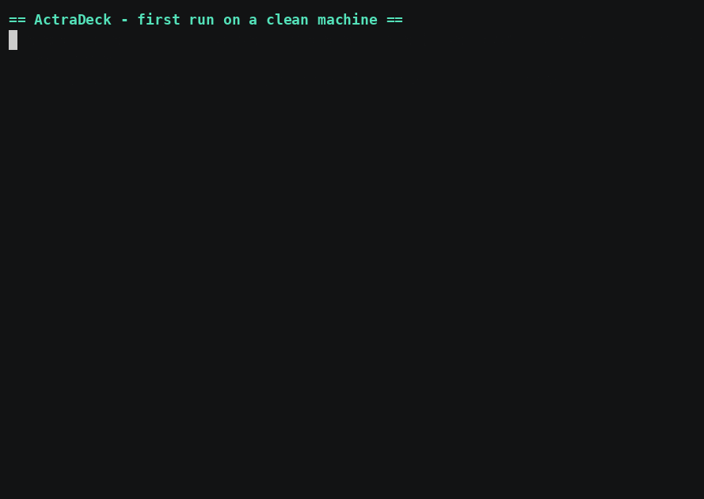
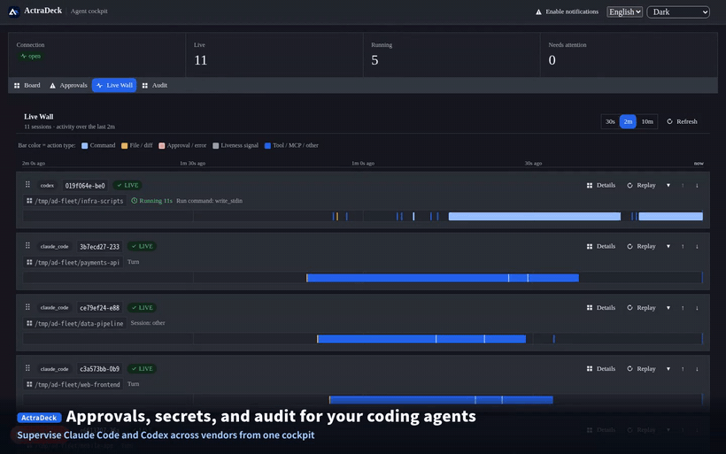

# Getting started

From a fresh clone to a running cockpit. There are two paths: a one-command
quickstart, and the manual steps it automates (use the manual steps if the
quickstart fails on your machine).

## Prerequisites

- **Node.js** v22.16+ and **pnpm** (`npm i -g pnpm`).
- **Docker** with `docker compose` (runs Postgres locally).
- **systemd --user** (Linux) for the always-on daemon mode. On macOS — or any host
  without systemd — `./scripts/quickstart` still sets everything up, and
  `./scripts/actradeck up` runs all four tiers in the **foreground** instead (keep the
  terminal open; Ctrl-C stops them all). A persistent launchd mode for macOS is planned.
- At least one agent installed: **Claude Code** (`claude`) and/or **Codex**
  (`codex`).

## Fast path — one command

```bash
./scripts/quickstart
```



It is idempotent and does the following:

1. Checks prerequisites.
2. Creates `.env` from `.env.example` with **randomly generated secrets** (mode
   `0600`) — an existing `.env` is never overwritten.
3. `pnpm install` (only if needed), then builds the workspace (`pnpm -r build`) so the
   backend and web UI can import the compiled dist of the shared `@actradeck/*` packages.
4. Starts Postgres via `docker compose` and waits until it is healthy.
5. Runs database migrations.
6. Brings up all tiers (`scripts/actradeck up` = backend + web UI + Claude Code
   attach + Codex attach).
7. Runs `scripts/actradeck doctor`.

When it finishes, open the cockpit at **http://localhost:55400**.

> **No systemd (e.g. macOS).** quickstart does everything _except_ start the tiers —
> the foreground supervisor has to stay attached to a terminal, so it can't run inside
> the setup script. quickstart prints the one command to run:
>
> ```bash
> ./scripts/actradeck up   # starts all four tiers in the foreground; Ctrl-C stops them
> ```
>
> Keep that terminal open, then open the cockpit. (A persistent launchd mode is planned.)

## Manual steps (what quickstart automates)

```bash
# 1. Config. Copy the template and fill in secrets (or let quickstart generate them).
cp .env.example .env
#    Set POSTGRES_PASSWORD, INGEST_TOKEN, REALTIME_TOKEN; keep DATABASE_URL in sync.
chmod 600 .env

# 2. Dependencies + build. Install, then build the workspace so the backend and web UI
#    can import the compiled dist of the shared @actradeck/* packages (event-model,
#    projection, design-tokens). Skipping this makes `actradeck up` fail on a fresh clone.
pnpm install
pnpm -r build

# 3. Database.
docker compose up -d                 # Postgres on :55432 (offset to avoid clashes)
pnpm db:migrate

# 4. Tiers (backend :55410 + web UI :55400 + attach daemons).
./scripts/actradeck up

# 5. (or, granular) attach daemons only:
./scripts/ad-attach install-all      # Claude Code + Codex attach as systemd --user units
```

## Verify

```bash
./scripts/actradeck doctor           # node / .env / linger / units / port listeners
./scripts/ad-attach status-all       # attach + codex-attach daemons
```

Then open **http://localhost:55400** — you should see the (empty) live session list.

## See your first session

Attach Mode requires no change to how you launch agents:

```bash
cd ~/any/project && claude           # or: codex
```

The session appears in the cockpit live list within a second or two, showing its
state, current action, repo/branch, and any pending approval.

Here is what the cockpit looks like in use — live wall, liveness-by-evidence,
secret redaction, cross-vendor audit, approval inbox, and replay:



Full walkthrough (~90s): [`media/usage.mp4`](./media/usage.mp4).

## Stopping / uninstalling

```bash
./scripts/actradeck down             # stop backend + webui + attach tiers (systemd)
./scripts/ad-attach uninstall-all    # remove attach daemons + un-wire settings
docker compose down                  # stop Postgres (add -v to drop the volume)
```

> On macOS / no systemd, the tiers run in the foreground — **Ctrl-C** in the
> `./scripts/actradeck up` terminal stops them all (`down` is a systemd-only command).

## Record the demo

- **Product demo (90s).** The cross-vendor governance / secret / audit story is in
  [`demo-90s.md`](./demo-90s.md). With the stack already up, that runbook is all you
  need (screen-record the cockpit while driving real `claude` / `codex` sessions).
- **First-run recording (the GIF above).** `media/first-run.gif` is a _real_
  clean-machine capture — a fresh clone driven through `./scripts/quickstart` to a
  running cockpit (Docker-isolated, default ports, secrets masked), recorded with
  [`asciinema`](https://docs.asciinema.org) + [`agg`](https://github.com/asciinema/agg);
  reproduce it on a throwaway
  container/VM so your live stack and shell state can't mask first-run friction.
- **Lighter read-only variant.** If you just want a quick narrated walkthrough on
  your own machine, [`../scripts/record-setup-cast.sh`](../scripts/record-setup-cast.sh)
  is non-destructive — it generates a throwaway `.env` with masked secrets and runs
  only read-only checks against your stack — writing `media/setup.cast` (source) and
  `media/setup.gif`.

## Troubleshooting

| Symptom                                              | Fix                                                                                                                |
| ---------------------------------------------------- | ------------------------------------------------------------------------------------------------------------------ |
| `doctor`: `:55400`/`:55410` not listening            | A tier failed to start. Check `./scripts/actradeck logs backend` / `logs webui`.                                   |
| Postgres never becomes healthy                       | `docker compose ps` / `docker compose logs postgres`. Ensure `POSTGRES_PASSWORD` is set in `.env`.                 |
| `pnpm db:migrate` fails to connect                   | `DATABASE_URL` must match `POSTGRES_PASSWORD` and `ACTRADECK_PG_PORT` (default `55432`).                           |
| Port already in use (`:55400` / `:55410` / `:55432`) | Change `ACTRADECK_WEBUI_PORT` / `ACTRADECK_BACKEND_PORT` / `ACTRADECK_PG_PORT` in `.env`, then re-run.             |
| Sessions never appear in the cockpit                 | `./scripts/ad-attach status-all`; ensure the daemon is active and you started `claude`/`codex` after install.      |
| `203/EXEC` after a Node upgrade (nvm)                | `node` path changed; re-run `./scripts/actradeck up` to regenerate the unit files.                                 |
| Want it to survive logout                            | `loginctl enable-linger "$USER"`.                                                                                  |
| `quickstart` aborts: Node too old                    | It enforces `package.json` `engines.node` (≥ 22.16). `nvm install 22 && nvm use 22`, then re-run.                  |
| `quickstart` aborts: Docker daemon not reachable     | Start Docker (Docker Desktop / `sudo systemctl start docker`) and ensure your user can run `docker`.               |
| macOS: `actradeck up` stays attached / `down` errors | No systemd on macOS — `up` runs the tiers in the foreground (Ctrl-C stops them). `down`/`status` are systemd-only. |

## Security note

`.env` holds local secrets (Postgres password, ingest/realtime tokens). It is
`git`-ignored, should be `0600`, and must never be committed. See
[`../SECURITY.md`](../SECURITY.md) and ADR
[0012](./adr/0012-threat-model-and-local-fs.md) for the threat model.
